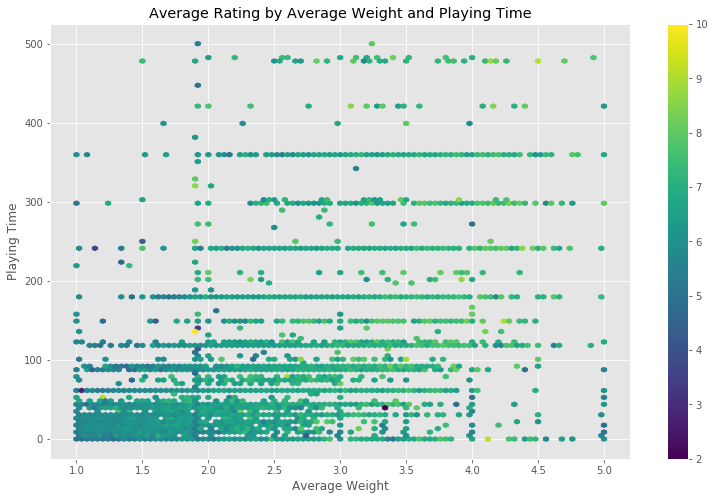
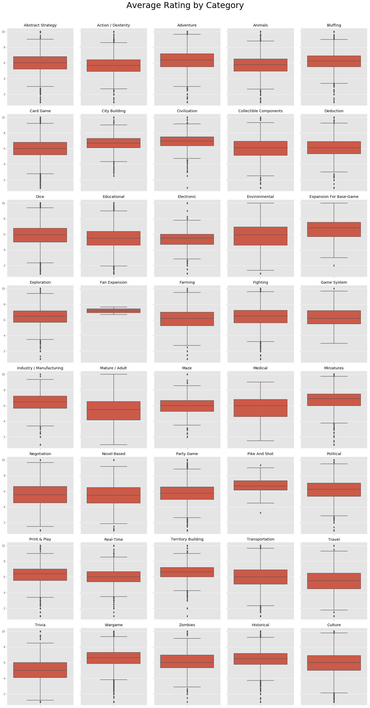
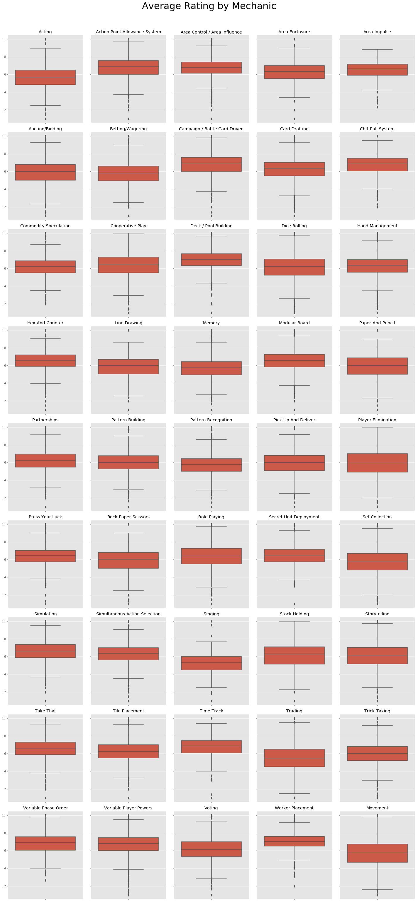
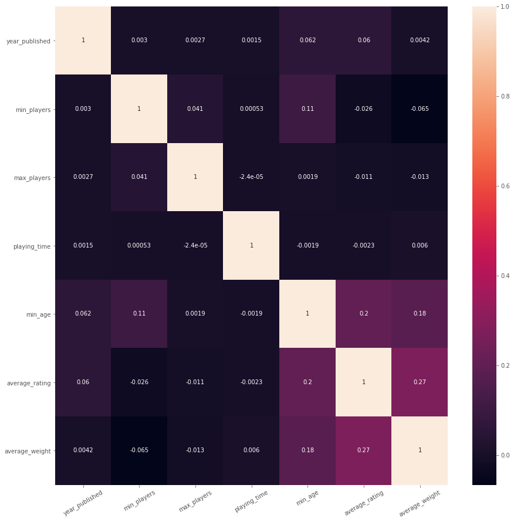
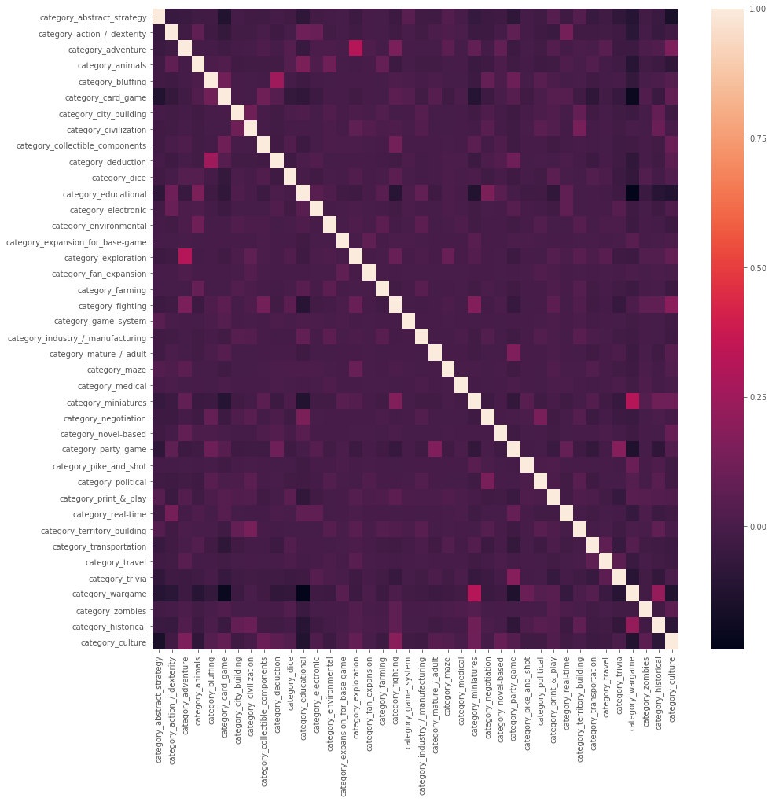
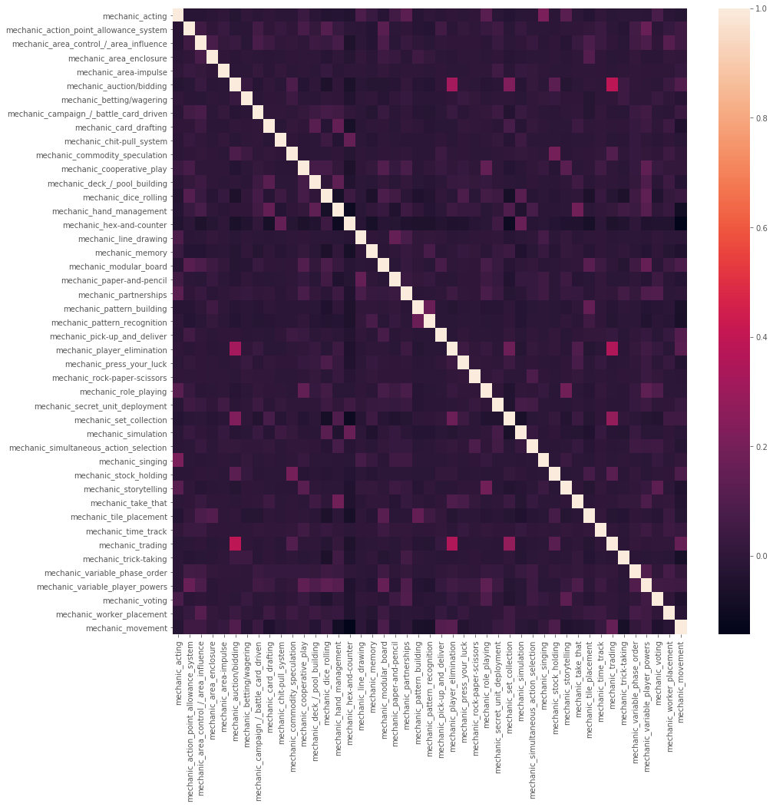
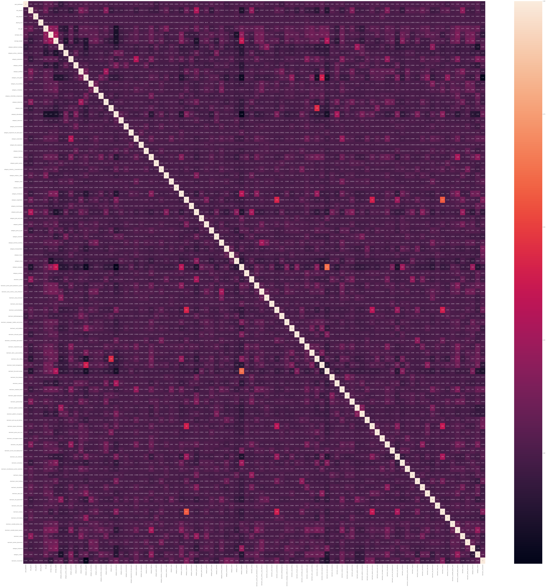
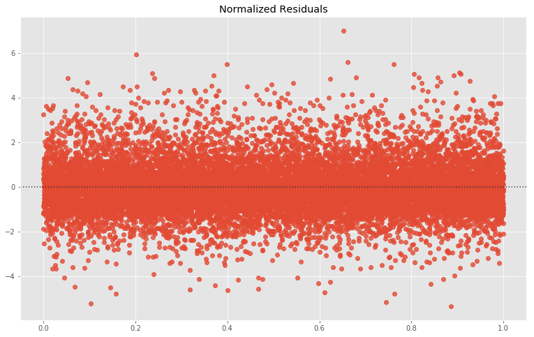
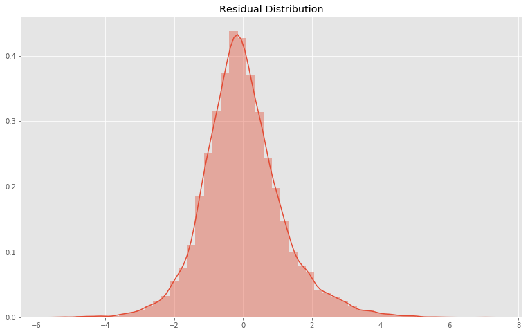
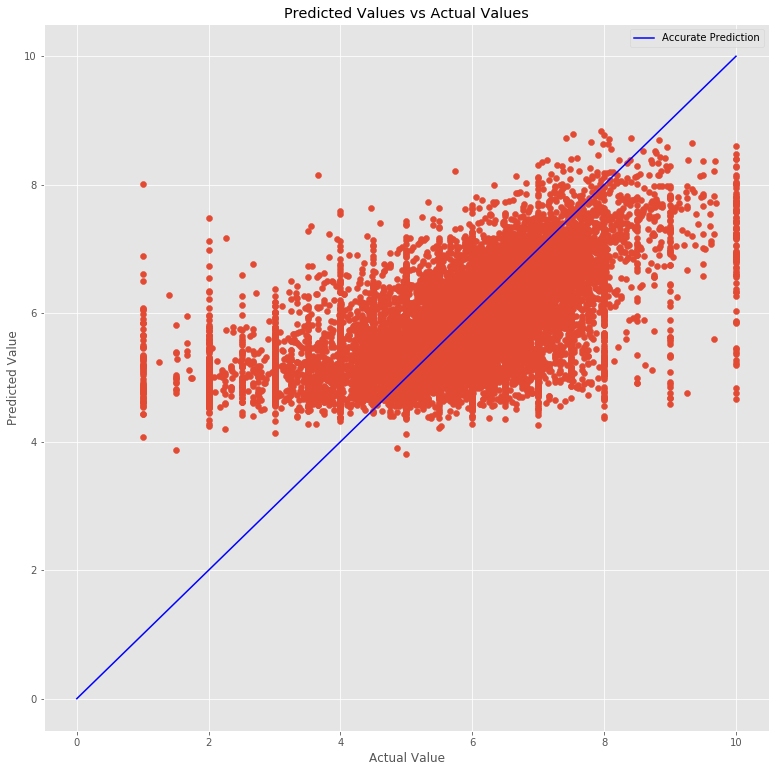

# Board Game Statistics

## Outline

This readme summarizes a project regarding the statistics of board games in order to predict ratings of future board games. The sections are as follows:

* [Abstract](#Abstract)
* [Results Summary](#Results-Summary)
* [Dashboard](#Dashboard)
* [Recommendations & Future Work](#Recommendations-%26-Future-Work)
* [Files & Descriptions](#Files-%26-Descriptions)
* [Data Information](#Data-Information)
* [Data Analysis](#Data-Analysis)
* [Modeling](#Modeling)

-------
## Abstract
An Analysis of Board Game Statistics<br><br>
In the last few decades, the popularity of board games has exploded, along with the number and variety of board games available. Many have said that we're now in a Golden Age of board games. The purpose of this project is to examine the statistics of thousands of available board games as well as their ratings (via boardgamegeek.com) in order to predict how well a newly released board game might rate amongst players based on its features such as category, mechanics, complexity, playing time, and number of players. <br><br>
<b>Question:</b> Given a number of board game features, what is the rating that board game is expected to receive?<br><br>
<b>Why?</b> As stated above, the popularity of board games has exploded in the last few decades, with new board games being created and developed daily, if not hourly. Analyzing the tens of thousands of existing games and their ratings in order to help future board game developers pin down things they could change, remove, or add to their games in order to increase their potential ratings, and thus the popularity of their game, can only help the genre as a whole.<br><br>
<b>Process:</b> The dataset was obtained from <a href='https://www.kaggle.com/mandshaw/games-0918'>Kaggle</a> and was gathered from <a href='https://www.boardgamegeek.com'>Board Game Geek</a>. This data was investigated and cleaned, then analyzed and engineered, combining multiple categories and mechanics to reduce overall dimensionality without sacrificing too much data. A base model was created, followed by multiple model tests to select the best initial option, and finally that best model was iterated upon to achieve the best rating predictions.

-------
## Results Summary
<br>
For this project, the final model chosen is a Gradient Boosting Regressor with the following parameters:
<ul>
    <li>Number of Estimators: 200</li>
    <li>Learning Rate: 0.1</li>
    <li>Max Depth: 2</li>
    <li>Max Features: Auto</li>
</ul><br>
This model returned the following results:
<ul>
    <li>Training RMSE: 1.1595</li>
    <li>Testing RMSE: 1.1579</li>
    <li>Training R2: 0.3518</li>
    <li>Testing R2: 0.3377</li>
</ul><br>

Further information, along with residual graphs and the final predictor graph, can be found in the [Modeling](#Modeling) section below.

-------
## Dashboard
<br>

-------
## Recommendations & Future Work
<br>
As the point of this project is to create a model that can predict the potential rating for a game, there aren't necessarily any recommendations outside of to continue creating board games to continue the "Board Game Golden Age" and increase the number and variability of games that are available.<br><br>

As for future work, I would like to go back and scrape my own data from Board Game Geek, partly to grab any games that have been added since the last update to this particular dataset, as well as scrape user data including their ratings, to create a recommendation system for people looking to start or expand their board game collections.

-------
## Files & Descriptions
<br>
<details><summary><b>Python Files</b></summary>
    
   * <b>[data_exploration.ipynb](data_exploration.ipynb)</b>
       * A jupyter notebook containing the initial import of the data as well the first round of investigation and cleaning.
   * <b>[eda_feature_engineering.ipynb](eda_feature_engineering.ipynb)</b>
       * A jupyter notebook containing further investigation of the data, engineering of features, and all exploratory data analysis.
   * <b>[modeling.ipynb](modeling.ipynb)</b>
       * A jupyter notebook containing the baseline model and all other model tests and iterations.
   * <b>[bg_functions.py](bg_functions.py)</b>
       * A python file containing functions related to feature engineering and modeling.
</details>

<details><summary><b>Data Files</b></summary>
    
   * <b>[games.csv](games.csv)</b>
       * A CSV file containing records of all board games available on <a href='https://www.boardgamegeek.com'>Board Game Geek</a>. This file was obtained from <a href='https://www.kaggle.com/mandshaw/games-0918'>Kaggle</a>.
   * <b>[formatted_data.csv](formatted_data.csv)</b>
       * A CSV file containing records of board games after formatting, cleaning, and pruning in the [Data Exploration Notebook](data_exploration.ipynb).
   * <b>[final_data.csv](final_data.csv)</b>
       * A CSV file containing the remaining board game records after feature engineering and further pruning in the [EDA/Feature Engineering notebook](eda_feature_engineering.ipynb).
</details>

-------
## Data Information
<br>
<details><summary><b>Board Game Dataset</b></summary><br>
The dataset is obtained from <a href='https://www.kaggle.com/mandshaw/games-0918'>Kaggle</a>, and initially includes 21 columns: ID, Type, Name, Year Published, Minimum Players, Maximum Players, Maximum Players, Playing Time, Minimum Playing Time, Maximum Playing Time, Minimum Age, Number of Users Rating, Average Rating, Bayes Average Rating, Total Number of Owners, Total Number of Traders, Total Number of Wanters, Total Number of Wishers, Total Number of Comments, Total User Weights, Average Weight, and Metadata.<br><br>    
The Metadata column contained another large number of features, including Artist, Category, Integration, Expansion, Family, Publisher, Mechanic, and Designer. This column was blown out so that each additional feature had its own column.<br><br>
The formatted data was reduced to Name, Year Published, Minimum and Maximum Players, Minimum Age, Playing Time (and Minimum and Maximum), Number of Users Rating, Average Rating, Total Owners, Total User Weights, Average Weight, and the Category and Mechanic columns from the Metadata, both of which were one-hot encoded so that each Category and each Mechanic had its own column, resulting in 148 total feature columns.<br><br>
The final dataset used for modeling dropped Minimum and Maximum Playing Time, Number of Users Rating, Total Owners, and Total User Weights, and combined multiple Category features and multiple Mechanic features, resulting in 93 feature columns.
</details>

-------
## Data Analysis

Full analysis can be found in the [EDA/Feature Engineering notebook](eda_feature_engineering.ipynb).

<details><summary><b>Category & Mechanic Combination</b></summary><br>
    After expanding the Category metadata into their own columns, there were around 80 categories. Looking through found a lot of categories that were quite similar, or at the very least in the same family. I was able to whittle down to 40 categories. I also combined a handful of mechanics into the Movement mechanic. The combinations include:
    <ul>
        <li><details><summary>Wargame</summary>
            <ul>
                <li>American Civil War</li>
                <li>American Indian Wars</li>
                <li>American Revolutionary War</li>
                <li>Civil War</li>
                <li>Korean War</li>
                <li>Modern Warfare</li>
                <li>Vietnam War</li>
                <li>World War I</li>
                <li>World War II</li>
            </ul>
        </details></li>
        <li><details><summary>Educational</summary>
            <ul>
                <li>Children's Game</li>
                <li>Economic</li>
                <li>Math</li>
                <li>Memory</li>
                <li>Number</li>
                <li>Puzzle</li>
                <li>Word Game</li>
            </ul>
        </details></li>
        <li><details><summary>Historical</summary>
            <ul>
                <li>Age of Reason</li>
                <li>American West</li>
                <li>Ancient</li>
                <li>Arabian</li>
                <li>Medieval</li>
                <li>Napoleonic</li>
                <li>Post-Napoleonic</li>
                <li>Prehistoric</li>
                <li>Renaissance</li>
            </ul>
        </details></li>
        <li><details><summary>Culture</summary>
            <ul>
                <li>Book</li>
                <li>Comic Book/Strip</li>
                <li>Fantasy</li>
                <li>Horror</li>
                <li>Humor</li>
                <li>Mafia</li>
                <li>Movies/TV/Radio Theme</li>
                <li>Murder/Mystery</li>
                <li>Music</li>
                <li>Mythology</li>
                <li>Pirates</li>
                <li>Religious</li>
                <li>Science Fiction</li>
                <li>Space Exploration</li>
                <li>Spies/Secret Agents</li>
                <li>Sports</li>
                <li>Video Game Theme</li>
            </ul>
        </details></li>
        <li><details><summary>Transportation</summary>
            <ul>
                <li>Aviation/Flight</li>
                <li>Nautical</li>
                <li>Racing</li>
                <li>Trains</li>
            </ul>
        </details></li>
        <li><details><summary>Movement (Mechanic)</summary>
            <ul>
                <li>Action/Movement Programming</li>
                <li>Area Movement</li>
                <li>Crayon Rail System</li>
                <li>Grid Movement</li>
                <li>Point-to-Point Movement</li>
                <li>Roll/Spin And Move</li>
                <li>Route/Network Building</li>
            </ul>
        </details></li>
    </ul>
</details>

<details><summary><b>Handling Null Values</b></summary><br>
    The biggest offenders for null values were the Average Weight and Playing Time columns. <br><br>
    For Average Weight, the null values were filled with the average weight across the whole column, which was just shy of 2. As Weight has to do with the complexity of the game, ~2 seemed to be a good choice, as 1 is intended for children, and 3 is starting to get into the more complex games, with 4 and 5 being reserved for games that take a long time to learn, setup, or play.<br><br>   
    For Playing Time, since it was equivalent to the Maximum Playing Time across the board, any rows with 0 that had something in Minimum Playing Time were replaced with their associated Minimum Playing Time, otherwise they were left as 0, since playing time can vary wildly across games, and trying to fill in with a mean, median, or mode just didn't feel right.<br><br>
</details>

<details><summary><b>Visualizations</b></summary>
    <ul>
        <li><details><summary><b>Average Ratings by Weight and Playing Time</b></summary>
                
        </details></li>
        <li><details><summary><b>Average Rating by Category</b></summary>
                
        </details></li>
        <li><details><summary><b>Average Rating by Mechanic</b></summary>
                
        </details></li>
        <li><details><summary><b>Base Features Correlation Matrix</b></summary>
                
        </details></li>
        <li><details><summary><b>Category Correlation Matrix</b></summary>
                
        </details></li>
        <li><details><summary><b>Mechanics Correlation Matrix</b></summary>
                
        </details></li>
        <li><details><summary><b>Overall Correlation Matrix</b></summary><br>
            Due to the size of this image, it may need to be opened in a new tab to be able to fully investigate. To save you the trouble, the highest correlations cross-group are category_wargame and mechanic_hex_and_counter at 0.62, and category_negotiation and mechanic_trading at 0.57. Most other high correlations can be seen in the group-specific correlation matrices above. <br><br>
                
        </details></li>
    </ul>
</details>


-------
## Modeling

<details><summary><b>Baseline Model</b></summary><br>
    My baseline model, without any scaling or other adjustments, was a linear regression model that returned an R-Squared score of 0.2169. I scaled my feature data using SKLearn's StandardScaler, and ran it again, achieving approximately the same result.<br><br>
</details>
<details><summary><b>Model Selection</b></summary><br>
    In order to find the best potential model, I ran a number of different models, including Lasso, Ridge, a Random Forest Regressor, and a Gradient Boost Regressor. Lasso and Ridge showed very minimal improvement, if any, while the Random Forest showed an increase in the R-Squared to 0.3144, with the Gradient Boost bringing it up a little more to 0.3383.<br><br>
</details>
<details><summary><b>Model Tuning</b></summary><br>
    As both the Random Forest and Gradient Boost showed marked improvement over Lasso and Ridge, I proceeded to create parameter grids for each, and ran them through GridsearchCV. These returned R-Squared scores of 0.3391 and 0.3566 respectively. <br><br>
</details>
<details><summary><b>Score Adjustment & Final Model</b></summary><br>
    At this point I realized that R-Squared was not the best option for model selection, as the number of features involved in this dataset was going to keep my R-Squared scores relatively low, albeit still statistically significant. Because of this, I began looking at MSE and RMSE, judging my models based on the average error, and in the end, selected a Gradient Boosting Regressor.
    <ul>
        <li><details><summary><b>Parameters</b></summary>
            <ul>
                <li>Number of Estimators: 200</li>
                <li>Learning Rate: 0.1</li>
                <li>Max Depth: 2</li>
                <li>Max Features: Auto</li>
            </ul>
        </details></li>
        <li><details><summary><b>Results & Residuals</b></summary>
            <ul>
                <li>Training RMSE: 1.1595</li>
                <li>Testing RMSE: 1.1579</li>
                <li>Training R2: 0.3518</li>
                <li>Testing R2: 0.3377</li>
                <li><details><summary>Residual Visualizations</summary>
                         <br>
                        
                </details></li>
                <li><details><summary>Prediction Graph</summary>
                        
                </details></li>
            </ul>
        </details></li>


```python

```
